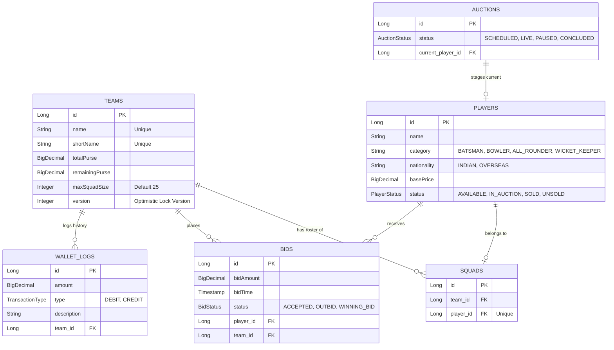

# 🏏 IPL Auction Software (REST API & Frontend Portal)


A robust, enterprise-grade full-stack portal for conducting **IPL (Indian Premier League) Player Auctions**. The system features a thread-safe, high-concurrency Spring Boot backend powered by **MySQL** and **Spring Data JPA** (using Pessimistic/Optimistic locking for double-bid prevention) alongside a premium, responsive single-page web app styled with glassmorphism and neon accents.

---

## 📌 Core Features

### 💻 1. Interactive Frontend Web Portal
A premium, responsive UI featuring glassmorphism styles, live updates, and navigation tabs:
*   **Auth Module**: User onboarding with registration and credentials authentication.
*   **Admin Dashboard**: Onboard franchises, stage players to the auction pool, and configure purse budgets.
*   **Live Auction Room**: Place bids in real-time, trigger increments, and execute hammer strikes.
*   **Squad & Purse Tracker**: Track real-time wallet balances, remaining player slots, and overseas quotas.

### 💰 2. Concurrency-Safe Bidding Engine
*   **Thread-Safe Transactions**: Backend protects against race conditions when multiple franchises bid on the same player at the same millisecond using database-level write locks.
*   **Self-Outbidding Prevention**: Restricts a franchise holding the current highest bid from bidding against itself.
*   **Dynamic IPL Bid Increments**: Automatically calculates the next minimum required bid based on current bid values:
    *   `Under ₹1.00 Crore`: **+ ₹10 Lakhs**
    *   `₹1.00 Cr - ₹5.00 Cr`: **+ ₹20 Lakhs**
    *   `₹5.00 Cr - ₹10.00 Cr`: **+ ₹25 Lakhs**
    *   `Over ₹10.00 Crore`: **+ ₹50 Lakhs**

### 🛡️ 3. Roster & Purse Constraint Rules
*   **Minimum Squad Reserve**: Enforces that franchises retain at least `(18 - squadCount) * ₹20 Lakhs` to ensure they can afford the mandatory minimum squad size of 18 players.
*   **Purse Check**: Rejects bids that exceed a team's remaining purse.
*   **Overseas Quota Cap**: Enforces a maximum of **8** overseas players per team squad.
*   **Squad Size Cap**: Enforces a maximum of **25** players per roster.
*   **Immutable Wallet Logs**: Writes a financial audit trail to `wallet_audit_logs` tracking every transaction.

---

## 📐 Architecture & Database Schema

The database model is structured to maintain transactional integrity, audit history, and fast query execution:



### 🔒 Concurrency Control: Pessimistic vs Optimistic Locking
To resolve high-frequency concurrent bid requests, the repository uses MySQL write locks (`SELECT ... FOR UPDATE`):
```java
@Lock(LockModeType.PESSIMISTIC_WRITE)
@Query("SELECT p FROM Player p WHERE p.id = :id")
Optional<Player> findByIdWithPessimisticLock(@Param("id") Long id);
```
The first transaction locks the player row, validates the bid increment and team purse, updates the active bid, and releases the lock on commit. Subsequent incoming bids queue up, preventing out-of-sync bid states.

---

## 📂 Project Structure

```text
ipl-auction-system/
├── css/                      # CSS styling files for frontend
│   ├── variables.css         # Theme color variables
│   ├── style.css             # Layout and routing styles
│   └── components.css        # Visual styles for tables, forms, cards
├── js/                       # Vanilla JS frontend components
│   ├── api.js                # Fetch API request/response interceptor
│   ├── config.js             # API base URL configuration mapping
│   ├── app.js                # Core app setup and SPA routing
│   ├── auth-controller.js    # Auth UI controller
│   ├── admin-controller.js   # Team & Player onboarding UI controller
│   ├── auction-controller.js  # Live Bidding room simulator
│   └── squad-controller.js   # Squad tracking and budget display
├── src/                      # Java Spring Boot Backend Source Code
│   ├── main/java/com/ipl/auction/
│   │   ├── config/           # CORS, JPA Auditing, OpenAPI Swagger Configurations
│   │   ├── controller/       # REST Endpoints (Auctioneer, Bidding, Purse)
│   │   ├── dto/              # Request / Response Data Transfer Objects
│   │   ├── entity/           # JPA Entity definitions (Team, Player, Bid, etc.)
│   │   ├── exception/        # Exception mapping & Global Handler
│   │   ├── repository/       # Repository interfaces with Pessimistic Locking
│   │   └── service/          # Core Business logic (BiddingEngine, Auctioneer)
│   └── main/resources/
│       ├── application.yml   # App configurations & Hikari connection pool
│       ├── schema.sql        # Core MySQL Schema definition
│       └── data.sql          # Seed data for local tests
├── index.html                # Main single-page web app entry point
├── pom.xml                   # Maven dependencies and build parameters
├── server.js                 # Node.js Static Web Server
└── team/member-1-config/     # Team onboarding configuration guides
```

---

## 🚀 Running the Application Locally

### 1. Database Configuration
Ensure MySQL Server is running locally on port `3306`:
1.  Log into your MySQL command-line or client.
2.  Create the database:
    ```sql
    CREATE DATABASE ipl_auction_db;
    ```
3.  Adjust your credentials (if they differ from `username: root` / `password: root`) in [application.yml](file:///c:/Users/hp/ipl-auction-system/src/main/resources/application.yml).

### 2. Launch the Backend API
Run the Spring Boot backend using the Maven wrapper:
```bash
# Clean and compile the backend
./mvnw.cmd clean compile

# Launch the Spring Boot application
./mvnw.cmd spring-boot:run
```
*The backend API will boot up on port `8080`.*

### 3. Launch the Frontend Portal
Start the lightweight Node.js web server to serve the frontend:
```bash
# Start the web server
node server.js
```
*   **Web Portal**: Access the UI at [http://localhost:3000](http://localhost:3000)
*   **Swagger API Specs**: Explore the API endpoints at [http://localhost:8080/swagger-ui.html](http://localhost:8080/swagger-ui.html)
*   **H2 Database Console**: Access the memory console (for testing/development fallback profiles) at [http://localhost:8080/h2-console](http://localhost:8080/h2-console) (JDBC URL: `jdbc:h2:mem:testdb`).

---

## 📡 REST API Specifications

### 🩺 Health Checks
*   **GET** `/api/v1/health` - Check health status of backend server.

### 🔨 Auctioneer Operations (`/api/v1/auction`)
*   **POST** `/api/v1/auction/stage` - Bring a player to the auction stage (`IN_AUCTION`).
*   **POST** `/api/v1/auction/players/{id}/hammer/sold` - Strike hammer: SOLD! Deducts purse, assigns player to squad, and closes the active auction.
*   **POST** `/api/v1/auction/players/{id}/hammer/unsold` - Pass player: UNSOLD.

### 📡 Live Bidding APIs (`/api/v1/bids`)
*   **POST** `/api/v1/bids/place` - Place a real-time incremental bid (Thread-safe).
*   **GET** `/api/v1/bids/player/{id}/current` - Get live price, winning team, and next minimum bid increment.
*   **GET** `/api/v1/bids/player/{id}/history` - Retrieve audit trail of all bids placed for a player.

### 💰 Team Purse & Quotas (`/api/v1/teams`)
*   **GET** `/api/v1/teams/{id}/purse-summary` - Get purse balance, remaining slots, and max spendable amount for a franchise.
*   **GET** `/api/v1/teams/purse-summary` - Fetch real-time purse summaries for all franchises.

---

## 🧪 Testing & Verification Guide

### Run Automated Tests
Execute the Maven test suite to check application health, bidding rules validation, and multi-threaded concurrency behavior:
```bash
./mvnw.cmd clean test
```

This runs:
1.  **`IplAuctionApplicationTests`**: Checks context load.
2.  **`BiddingEngineServiceTest`**: Asserts opening bids, increments slabs, self-outbidding blocks, and purse limits.
3.  **`BiddingEngineConcurrencyTest`**: Simulates concurrent bids using `ExecutorService` and `CountDownLatch` to ensure thread safety under heavy loads.
